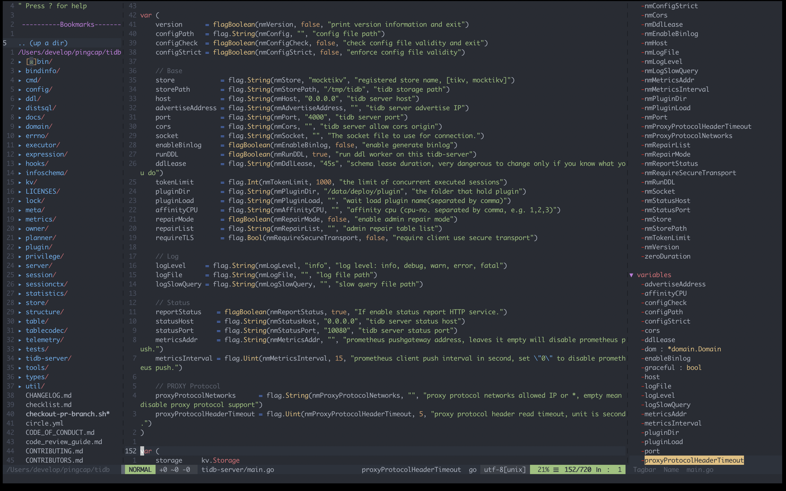

# Vim 配置

配置统一环境，在不同平台得到一样的体验～

最终效果：



## Vim

Vim是从vi发展出来的一个文本编辑器。其代码补完、编译及错误跳转等方便编程的功能特别丰富，在程序员中被广泛使用。和Emacs并列成为类Unix系统用户最喜欢的编辑器。

**Vim 模式**

- 普通模式
  在普通模式中，用的编辑器命令，比如移动光标，删除文本等等。这也是Vim启动后的默认模式。这正好和许多新用户期待的操作方式相反（大多数编辑器默认模式为插入模式）。
- 插入模式
  在这个模式中，大多数按键都会向文本缓冲区中插入文本。大多数新用户希望文本编辑器编辑过程中一直保持这个模式。
  在插入模式中，可以按ESC键回到普通模式。
- 可视模式
  这个模式与普通模式比较相似。但是移动命令会扩大高亮的文本区域。高亮区域可以是字符、行或者是一块文本。当执行一个非移动命令时，命令会被执行到这块高亮的区域上。Vim的"文本对象"也能和移动命令一样用在这个模式中。
- 命令行模式
  在命令行模式中可以输入会被解释成并执行的文本。例如执行命令（":"键），搜索（"/"和"?"键）或者过滤命令（"!"键）。在命令执行之后，Vim返回到命令行模式之前的模式，通常是普通模式。
- 选择模式
- Ex 模式


**vimrc 中 rc 含义**

rc= RunCom =Run commands

> "rc" 是取自 "runcom", 来自麻省理工学院在 1965 年发展的 CTSS系统。相关文献曾记载这一段话: '具有从档案中取出一系列命令来执行的功能；这称为 "run commands" 又称为 "runcom"，而这种档案又称为一个 runcom (a runcom)。


**不足之处**

- 大文件读取速度很慢（可在vim.org下载并安装名为LargeFile的Script来优化）LargeFile
- 即使文件不大，如果有非常长的行的话，处理也会变慢（同上）
- vim自己的脚本语言处理速度不快，若是安插过多脚本包，引导速度会变慢。
- 存在类似Ctrl-1等不能被映射的键（限于某些字符终端的性能）


## 基本操作

vim 配置信息都放在 [.vimrc](.vimrc) 中，包含基本信息、快捷键、插件、主题等信息，若有增删，可以直接编辑其文件内容。在新机器上的配置流程大致如下：

1. 软链文件

	```
	ln -sf /path/to/.vimrc ~/.vimrc
	```

2. 安装插件管理工具

	```
	curl -fLo ~/.vim/autoload/plug.vim --create-dirs  https://raw.githubusercontent.com/junegunn/vim-plug/master/plug.vim 
	```
	vim 插件包管理器，还有 [Vundle](https://github.com/VundleVim/Vundle.vim)，这里使用 [vim-plug](https://github.com/junegunn/vim-plug)

3. 安装插件

	```
	vim ~/.vimrc
	:PlugInstall
	```

	插件会自动下载安装，直到提示 Finishing … Done 即完成安装。

4. 删除插件

	```
	vim ~/.vimrc
	:PlugClean
	```
	
	将不需要的插件注释或者删除并执行删除命令即可。


## 插件列表

在 [.vimrc](.vimrc) 配置文件中，配置了很多插件，但是有些插件还是需要单独配置。

**vim-go**

go 语言插件，安装后还需要很多 go 包才能正常工作。
这里需要提前配置好 GO PATH ，保证可用。

```
vim ~/.vimrc
:GoInstallBinaries
```

**YouCompleteMe**

用来自动完成，不需要手动做一些额外的配置。

1. 安装依赖关系

	```
	apt install build-essential cmake python3-dev
	yum install gcc gcc-c++ make  //  equivalent of build-essential in CentOS.
	```

2. 编译

	```
	cd ~/.vim/plugged/YouCompleteMe
	# 编译，并加入 go 的支持
	python3 install.py --go-completer 
	```

## FAQ

- python3 not support error?
	```
	brew reinstall vim
	```


## Vim8.0 python3.6

```
git clone https://github.com/vim/vim.git
cd vim/src
./configure --prefix=/usr/local/vim-8.0
make && make install
```

```
./configure --prefix=/usr/local/vim-8.0 \
 --with-features=huge \
 --enable-multibyte \
 --enable-rubyinterp=yes \
 --enable-pythoninterp=yes \
 --enable-python3interp=yes \
 --with-python3-config-dir=/usr/lib/python3.6/ \
 --enable-perlinterp=yes \
 --enable-luainterp=yes \
 --enable-gui=gtk2 \
 --enable-cscope
```


```
mv /usr/bin/vim /usr/bin/vim7
mv /usr/bin/vi /usr/bin/vi7
# 添加新链接
ln -s /usr/local/vim-8.0 /usr/local/vim
ln -s /usr/local/vim/bin/vim /usr/bin/vi
ln -s /usr/local/vim/bin/vim /usr/bin/vim
# 添加环境变量
```